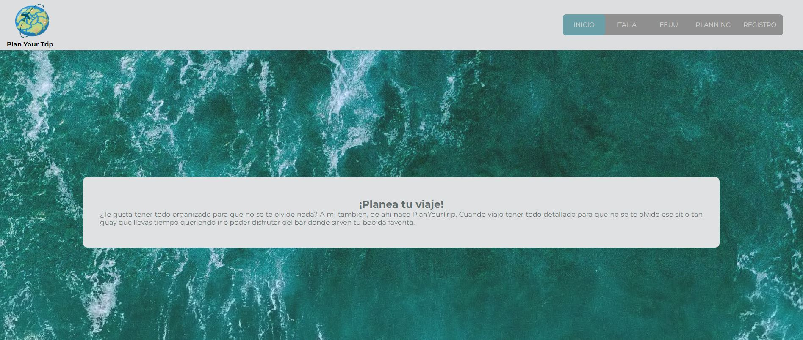

# Plan Your Trip

Página para crear tu itinerario de viaje, para tener todo detallado.

http://planyourtrip.myvnc.com:3000/

## Prerequisitos

**Node.js**

Para comprobar si Node.js esta instalado:
entrar en la terminal e introducir el comando:
node -v
si aparece un mensaje como: v.12-16-10
Eso significa que está instalado correctamante, si no, tienes que entrar en la siguiente página
https://nodejs.org/ y hacer click en versión LTS para descargar e instalar.

**NPM**

En la terminal ponemos:

*npm init*

Con esto arrancamos npm, despues ponemos:

*npm install*

Así se instala todos los paquetes que he usado en el proyecto.

## Conectar con Backend

Esta parte del proyecto es el frontend, se verá de la siguiente forma:

Para que el proyecto funcione hay que clonar el siguiente repositorio:

https://github.com/AinhoaSalo/finalProyect_back

Esta es la parte del backend con la que conecta el proyecto.

